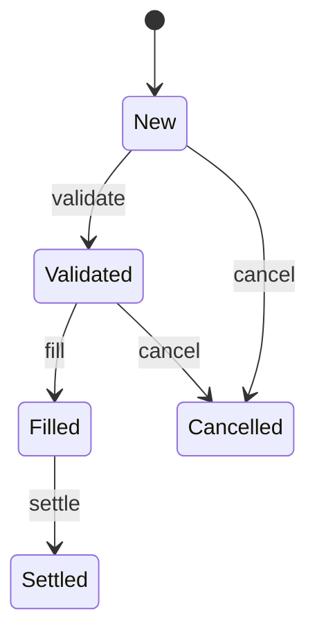

# State Machine Pattern

> **Phase relevance:** Plan, Tasks, Implement
> **DDD context:** Complex Aggregate lifecycles with explicit, auditable state transitions.

---

## 1. Intent

A **State Machine** models an entity whose behavior and allowed operations
change depending on its current state. It replaces fragile boolean flag
combinations and scattered `if (status == ...)` checks with an explicit,
verifiable transition graph.

---

## 2. When to Use

| Signal | Example |
|--------|---------|
| An entity has a "status" or "state" field with more than two values. | Order: `New → Validated → Filled → Settled → Cancelled` |
| Certain operations are only valid in specific states. | Cannot cancel a settled order. |
| State transitions emit domain events. | `OrderFilled` triggers downstream settlement. |
| Compliance requires an audit trail of every transition. | Healthcare, banking, trading. |

---

## 3. Structural Rules

| Element | Constraint |
|---------|------------|
| **State enum** | Exhaustive, closed set. No "Unknown" or catch-all. |
| **Transition table** | Explicit mapping of `(CurrentState, Event) → NextState`. Anything not in the table is illegal. |
| **Guard conditions** | Business rules checked *before* the transition fires. |
| **Side effects** | Domain events emitted *after* a successful transition. |
| **Persistence** | Store the current state and a version counter on the Aggregate Root. |

---

## 4. Language-Idiomatic Examples

```python
# Python — transition table as dict
from enum import Enum, auto
from dataclasses import dataclass

class OrderState(Enum):
    NEW = auto()
    VALIDATED = auto()
    FILLED = auto()
    SETTLED = auto()
    CANCELLED = auto()

TRANSITIONS: dict[tuple[OrderState, str], OrderState] = {
    (OrderState.NEW, "validate"):       OrderState.VALIDATED,
    (OrderState.VALIDATED, "fill"):     OrderState.FILLED,
    (OrderState.FILLED, "settle"):      OrderState.SETTLED,
    (OrderState.NEW, "cancel"):         OrderState.CANCELLED,
    (OrderState.VALIDATED, "cancel"):   OrderState.CANCELLED,
}

@dataclass
class Order:
    state: OrderState = OrderState.NEW
    _events: list = ...

    def apply(self, action: str) -> Result[None, str]:
        key = (self.state, action)
        next_state = TRANSITIONS.get(key)
        if next_state is None:
            return Err(f"Cannot '{action}' from {self.state.name}")
        self.state = next_state
        self._events.append(StateTransitioned(action, next_state))
        return Ok(None)
```

```typescript
// TypeScript — discriminated union + exhaustive switch
type OrderState = "new" | "validated" | "filled" | "settled" | "cancelled";

const transitions: Record<string, OrderState | undefined> = {
  "new:validate": "validated",
  "validated:fill": "filled",
  "filled:settle": "settled",
  "new:cancel": "cancelled",
  "validated:cancel": "cancelled",
};

function transition(current: OrderState, action: string): Result<OrderState, string> {
  const next = transitions[`${current}:${action}`];
  if (!next) return err(`Cannot '${action}' from '${current}'`);
  return ok(next);
}
```

---

## 5. Visualization Requirement

During `/speckit.plan`, every Aggregate with a state machine **must** include a
Mermaid state diagram in the System Design Plan:



---

## 6. AI Agent Directives

1. Any Aggregate with more than two status values **must** be implemented as an
   explicit state machine with a transition table.
2. **Never** use a chain of `if/elif` on a status field to determine allowed
   operations. Use the transition table lookup.
3. Illegal transitions must return a `Result.Err` — never throw an exception
   and never silently ignore.
4. Every state transition must emit a domain event recording the old state,
   new state, trigger, and timestamp.
5. The System Design Plan must include a Mermaid state diagram for each
   stateful Aggregate.

---

## References

- Gang of Four, *Design Patterns* (1994) — State.
- See also: Domain-specific extensions in
  `../../fintech-trading/design-patterns/state-pattern-order-lifecycle.md`.
