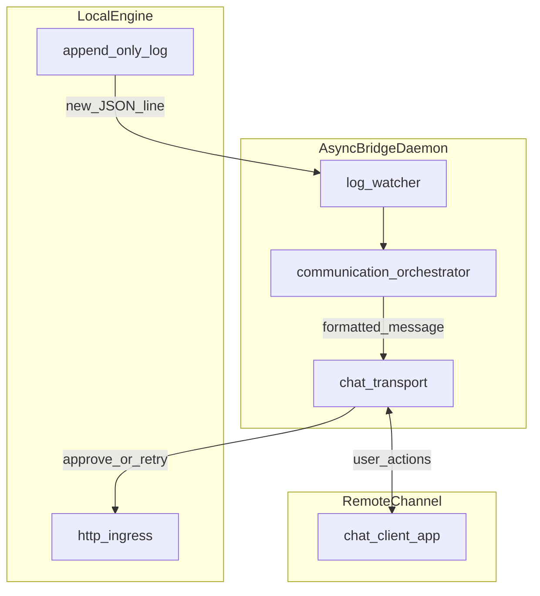

# Asynchronous Event-Loop Architecture (AI-First)

> **Applicability:** Long-running integration daemons, notification bridges, log
> tailers, and chat or HTTP sidecars that run beside a local engine or tool.
> **Phase relevance:** Plan, Tasks, Implement (especially Tool Plan projects).
> Use when a single process must wait on multiple I/O-bound sources at once
> without thread sprawl.

---

## 1. Intent

Coordinate **overlapping waits** (filesystem notifications, outbound chat APIs,
inbound HTTP callbacks) in **one asyncio event loop**. Keep ingestion,
dispatch, and side effects in separate modules so humans and AI agents can
follow control flow from logs and small files.

This pattern complements `cli-orchestrator-architecture.md`: prefer
exit-and-resume there by default; choose this pattern when constraints require a
**persistent reactive process**.

---

## 2. When to Use vs Exit-and-Resume

`cli-orchestrator-architecture.md` §6 recommends exiting after notifications
and resuming via an explicit command. Use **this** pattern when you need, in one
process:

- continuous ingestion (e.g. append-only log or watch) **while**
- waiting on user interaction in a channel (e.g. chat) **and/or**
- serving or calling HTTP toward a co-located API

If a one-shot CLI or cron-style step suffices, do not add a daemon.

---

## 3. Layered Structure

### 3.1 Ingestion (Observer)

- Prefer **push-style** sources over busy polling (e.g. filesystem watch APIs
  that wake on change, or async streams from a library).
- Normalize raw bytes/lines into **typed, validated** events at this boundary.
- Treat ingestion as read-only with respect to business decisions; it only
  delivers facts.

### 3.2 Orchestrator (Dispatcher)

- Parse JSON (or other schema) into a small event model; reject malformed
  payloads with structured logs.
- Route by **event type** using an explicit mapping (table or registry): e.g.
  `gate.failed` → format alert + retry actions; `phase.completed` → status
  update; `approval.required` → approval prompt + buttons.
- Keep **formatting and UI affordances** separate from **transport** (HTTP vs
  chat SDK).

### 3.3 Actuators (Async I/O)

- Use **async** clients for network I/O (`httpx`, async chat SDKs, etc.).
- Avoid blocking calls in the event loop; offload only when a library has no
  async API and wrapping is unavoidable.
- Timeouts and cancellation hooks are mandatory for outbound calls.

---

## 4. Reference Example: Reactive Relay

One valid instance (not prescriptive for all stacks):

- **Ingestion:** watch an append-only log (e.g.
  `.specify/context/engine.log`) for new JSON lines.
- **Orchestrator:** map event types to Telegram messages and inline actions.
- **Actuators:** `python-telegram-bot` (async) outbound; `httpx` inbound/outbound
  to a local `itx-engine serve` (or similar) HTTP API.

Event vocabulary should stay aligned with project notification contracts where
they exist (see `notification-events.yml` in the knowledge base index).

---

## 5. Contrast With Event-Driven Microservices

`event-driven-microservices.md` addresses **multiple deployable services**,
brokers, and Bounded Context boundaries. This pattern is **single-process,
local integration**: no Kafka/Rabbit requirement, no cross-team deployment
split. Use microservice event guidance when services and message infrastructure
are first-class.

---

## 6. Operational Notes

- **Failure isolation:** if the engine restarts or disappears, the bridge may
  outlive it; detect stale sources or failed health checks and surface a clear
  operator-facing signal (structured log + optional outbound alert).
- **Resource profile:** asyncio + async HTTP typically yields a smaller memory
  footprint than many threads; still set bounded queues and avoid unbounded
  buffering of events.
- **Shutdown:** handle SIGTERM; cancel tasks; flush or drop explicitly per
  product policy.

---

## 7. AI-First Messaging

- Prefer **structured events** and short summaries over dumping entire artifact
  files into chat.
- When gate or spec-kit feedback lives in markdown (e.g. `gate_feedback.md`),
  extract stable sections (e.g. a **Remediation** heading) instead of pasting
  the full document.
- Keep templates and extractors in a small dedicated module for testability.

---

## 8. Testing Strategy

Align with constitution Tool Plan E2E expectations: exercise the **external
boundary** (subprocess, HTTP contract, or produced artifacts).

- Use async test runners (`pytest-asyncio` or equivalent) with **explicit
  timeouts**.
- Mock chat and HTTP at the adapter boundary; feed synthetic log lines or
  in-memory watch events into the orchestrator.
- Where feasible, integration-test with a temporary log file and a local test
  HTTP server.

See `e2e-testing-strategy.md` for journey coverage and isolation rules when the
daemon participates in a user-visible flow.

---

## 9. Architecture Diagram

---

## 10. AI Agent Directives

1. Default to `cli-orchestrator-architecture.md` exit-and-resume; adopt this
   pattern only when concurrent I/O waits justify a daemon.
2. Keep ingestion, dispatch, and actuators in separate modules; validate events
   at the ingestion boundary.
3. Use async I/O throughout the hot path; no blocking network calls in coroutines
   without an explicit offload story.
4. Prefer extracting stable sections from spec-kit artifacts over sending whole
   files to operators.
5. Document event types and schemas next to the orchestrator; keep the mapping
   table easy to grep and extend.

---

## References

- See also: `cli-orchestrator-architecture.md`, `foundational-principles.md`,
  `e2e-testing-strategy.md`.
- Contrast: `event-driven-microservices.md` (multi-service, broker-based EDA).
