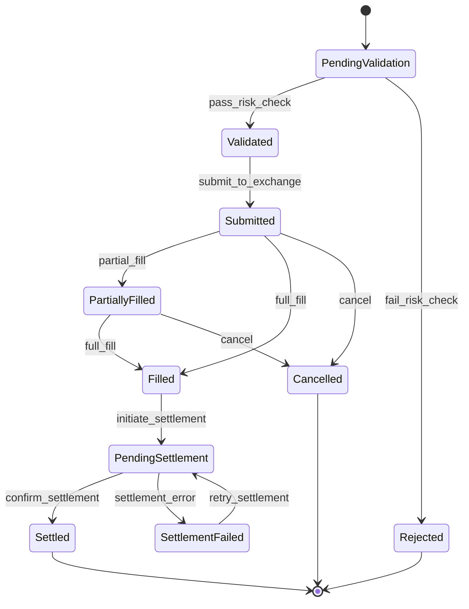

---
tags:
  - state-machine
  - order
  - lifecycle
  - settlement
  - exchange
  - risk
  - transition
anti_tags:
  - react
  - ui
  - frontend
  - component
  - table
  - grid
  - modal
  - button
  - toast
  - browser
  - css
  - html
phases:
  - after_plan
  - after_tasks
  - after_review
---

# State Pattern: Trading Order Lifecycle

> **Domain:** Fintech — Trading
> **Phase relevance:** Plan, Tasks, Implement
> **Extends:** `../../base/design-patterns/state-machine-pattern.md`

---

## 1. Context

A trading order passes through a series of states governed by exchange
protocols, risk checks, and settlement rules. The lifecycle is complex enough
that ad-hoc status checks lead to missed edge cases, regulatory violations, and
reconciliation failures.

---

## 2. Canonical Order State Machine

---

## 3. State Definitions

| State | Invariants |
|-------|------------|
| `PendingValidation` | Order created but not yet risk-checked. No exchange interaction. |
| `Validated` | Risk check passed. Order is eligible for submission. |
| `Rejected` | Risk check failed. Terminal state. Must record rejection reason. |
| `Submitted` | Sent to exchange. Awaiting execution report. |
| `PartiallyFilled` | Some quantity executed. `filled_qty < total_qty`. |
| `Filled` | Entire quantity executed. Ready for settlement. |
| `Cancelled` | Order withdrawn before full fill. Must report remaining quantity. |
| `PendingSettlement` | Fill confirmed; awaiting T+n settlement cycle. |
| `Settled` | Cash and securities exchanged. Terminal state. |
| `SettlementFailed` | Settlement rejected by clearinghouse. Retriable. |

---

## 4. Transition Rules

| From | Event | Guard | To |
|------|-------|-------|----|
| PendingValidation | `pass_risk_check` | Position limits OK, margin sufficient | Validated |
| PendingValidation | `fail_risk_check` | — | Rejected |
| Validated | `submit_to_exchange` | Exchange session open | Submitted |
| Submitted | `partial_fill` | `fill_qty > 0 && fill_qty < order_qty` | PartiallyFilled |
| Submitted | `full_fill` | `fill_qty == order_qty` | Filled |
| PartiallyFilled | `full_fill` | Cumulative fills == order_qty | Filled |
| Submitted / PartiallyFilled | `cancel` | Exchange accepts cancel ack | Cancelled |
| Filled | `initiate_settlement` | — | PendingSettlement |
| PendingSettlement | `confirm_settlement` | Clearinghouse confirmation | Settled |
| PendingSettlement | `settlement_error` | — | SettlementFailed |
| SettlementFailed | `retry_settlement` | Retry count < max | PendingSettlement |

---

## 5. Domain Events per Transition

Every transition **must** emit a domain event:

- `OrderRiskChecked { orderId, result: passed | failed, reason? }`
- `OrderSubmitted { orderId, exchangeOrderId, timestamp }`
- `OrderPartiallyFilled { orderId, fillQty, fillPrice, cumulativeQty }`
- `OrderFilled { orderId, avgPrice, totalQty }`
- `OrderCancelled { orderId, remainingQty, cancelReason }`
- `SettlementInitiated { orderId, expectedSettlementDate }`
- `SettlementConfirmed { orderId, settlementId }`
- `SettlementFailed { orderId, errorCode, errorMessage }`

---

## 6. AI Agent Directives

1. Implement the order lifecycle as an explicit state machine (transition table
   or sealed state hierarchy) — never as scattered if/else on a status string.
2. Every transition must be guarded, auditable, and emit the corresponding
   domain event.
3. Terminal states (`Rejected`, `Cancelled`, `Settled`) must be immutable —
   no further transitions allowed.
4. Partial fills must track cumulative quantity as a Value Object, not a raw
   `int`.
5. Include the Mermaid state diagram above in the System Design Plan.
6. Settlement retry logic must cap attempts and escalate to an alert after max
   retries (see `../anti-patterns/blocking-io-hot-paths.md` for latency
   guidance).
